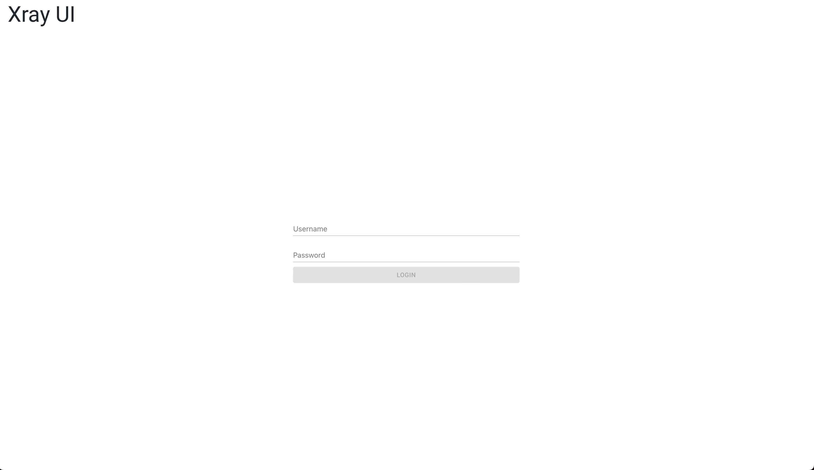
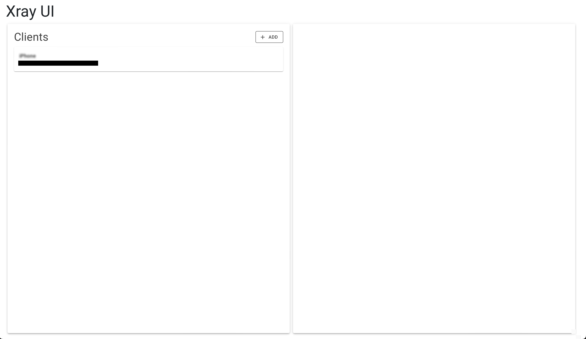
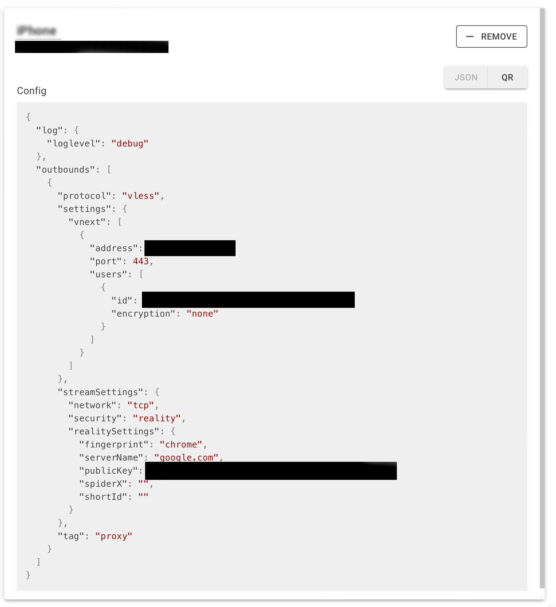
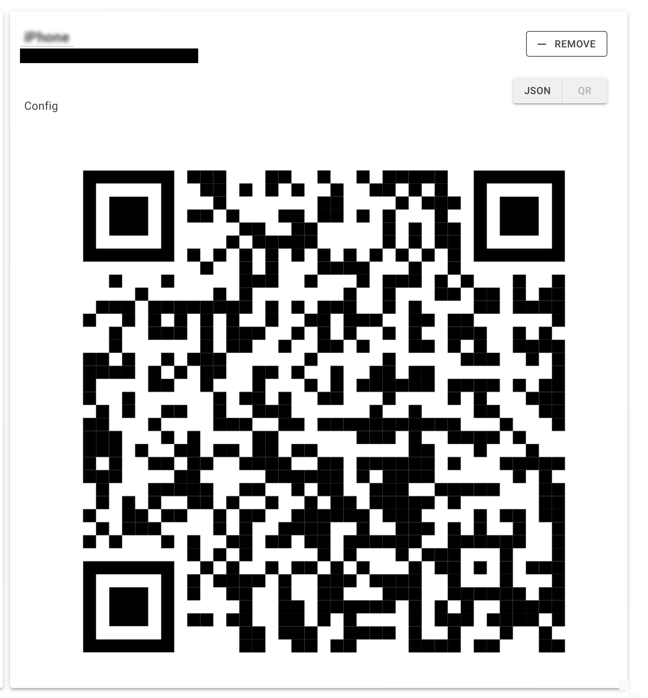

# XrayUI

Tool for configuring Xray VPN and manage its clients via UI

* [Installation](#installation)
* [Manual configuration](#manual-configuration)
    * [docker-compose.yaml](#docker-composeyaml)
    * [xray-ui-config.json](#xray-ui-configjson)
* [GitHub Actions](#github-actions)
    * [docker-compose.yaml](#docker-composeyaml-1)
    * [deploy.yaml](#deployyaml)
* [Usage](#usage)
* [Login](#login)
* [Clients page](#clients-page)
* [Managing client](#managing-client)
* [Configuration](#configuration)

## Installation

There are a couple of options to install and configure xray-ui: manual configuration and GitHub Actions.

### Manual configuration

Manual configuration assumes that you are going to set up your VPN directly on your VM, without any automation.

When configuring xray-ui manually, you will need to set up two files: `docker-compose.yaml` add `xray-ui-config.json`.

#### docker-compose.yaml

```yaml
version: '3.9'

services:
  custom-xray:
    image: ghcr.io/ronimizy/xray-ui:master
    container_name: xray
    ports:
      - "8080:8080"
      - "443:443"
    volumes:
      - ./xray-ui-config.json:/app/xray-ui-config.json
      - persistence-volume:/persistence

volumes:
  persistence-volume:
    name: xray-ui-persistence
    external: true
```

#### xray-ui-config.json

```json
{
  "Authorization": {
    "Username": "username",
    "Password": "password"
  },
  "Persistence": {
    "DatabasePath": "/persistence"
  },
  "Xray": {
    "Server": {
      "PrivateKey": "---"
      // ypur private key here
    },
    "Client": {
      "ServerAddress": "127.0.0.1",
      // your server IP here
      "PublicKey": "---"
      // your public key here
    }
  }
}
```

This config overrides only necessary values, there some extra options to customize (see [Configuration](#configuration)
section).

### GitHub Actions

If you want to automate VPN deployment process, you can use GitHub Actions.

1. create a GitHub repository (preferably private)
2. add custom Actions runner to your repository
3. create `docker-compose.yaml` file for your deployment
4. create `deploy.yaml` workflow to deploy your xray-ui instance

#### docker-compose.yaml

```yaml
services:
  custom-xray:
    image: ghcr.io/ronimizy/xray-ui:master
    container_name: xray
    ports:
      - "8080:8080"
      - "443:443"
    volumes:
      - persistence-volume:/persistence
    environment:
      Authorization__Username: ${VPN_USERNAME}
      Authorization__Password: ${VPN_PASSWORD}
      Persistence__DatabasePath: "/persistence"
      Xray__Server__PrivateKey: ${VPN_PRIVATE_KEY}
      Xray__Client__ServerAddress: ${VPN_ADDRESS}
      Xray__Client__PublicKey: ${VPN_PUBLIC_KEY}

volumes:
  persistence-volume:
    name: xray-ui-persistence
    external: true
```

Here, we use environment variables (which are later will be supplied in GitHub Actions workflow) to avoid storing
sensitive data in repository and VM.

#### deploy.yaml

```yaml
name: deploy xray

on:
  push:
    branches:
      - 'master'
    paths:
      - '.github/workflows/deploy.yaml'
      - 'docker-compose.yaml'
  workflow_dispatch:

env:
  REGISTRY: ghcr.io

jobs:
  deploy-xray:
    runs-on: self-hosted

    steps:
      - name: Checkout repository
        uses: actions/checkout@v3

      - name: login to GitHub docker registry
        uses: docker/login-action@v2
        with:
          registry: ${{ env.REGISTRY }}
          username: ${{ github.actor }}
          password: ${{ secrets.GITHUB_TOKEN }}

      - name: docker compose pull
        run: |
          docker compose pull

      - name: docker compose up
        run: |
          VPN_USERNAME=${{ secrets.VPN_USERNAME }} \
          VPN_PASSWORD=${{ secrets.VPN_PASSWORD }} \
          VPN_PRIVATE_KEY=${{ secrets.VPN_PRIVATE_KEY }} \
          VPN_ADDRESS=${{ secrets.VPN_ADDRESS }} \
          VPN_PUBLIC_KEY=${{ secrets.VPN_PUBLIC_KEY }} \
          docker compose up -d
```

- Before running this workflow, you should add sensitive data to GitHub Actions secrets.
- we use `workflow_dispatch` trigger to allow you triggering redeploy manually (ex: when secrets changed)
- we use `docker compose pull` to always pull a latest version of xray-ui

## Usage

### Login

After deployments succeeded you can access the UI. You will be prompted to log in, using credentials that you specified
earlier in configuration.



### Clients page

After logging in, you will be redirected to Clients page, where you can add new clients and manage existing ones.



### Managing client

For existing clients, you can export its config either as json or QR code.



> Even though there is a copy button for json config, there are some compatibility issues with Safari, and it might not
> work correctly



## Configuration

xray-ui does NOT support excessive xray configuration, but there are some options available.

```json
{
  "Authorization": {
    // required
    "Username": string,
    // required
    "Password": string
  },
  "Persistence": {
    // path in container where SQLite files will be stored, default = /app
    "DatabasePath": string
  },
  "Xray": {
    // path in container where xray server config will be stored, default /app/config.json
    "ConfigPath": string
    "Server": {
      // default = debug
      "LogLevel": string
      // port on which xray will be listening inside container, default = 443
      "InboundPort": int
      // required, private key for xray server
      "PrivateKey": string,
      // Reality configuation
      "Reality": {
        // url:port, destination address for Reality masking
        "Destination": string,
        // url, server addresses for Reality masking
        "ServerNames": [
          string
        ]
      }
    },
    "Client": {
      // default = debug
      "LogLevel": string,
      // required, IP address of your host VM
      "ServerAddress": string,
      // default = 443
      "ServerPort": int,
      // required, public key for xray clients
      "PublicKey": string
    }
  }
}
```